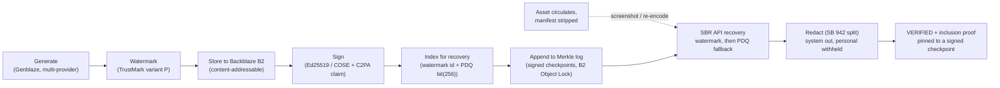
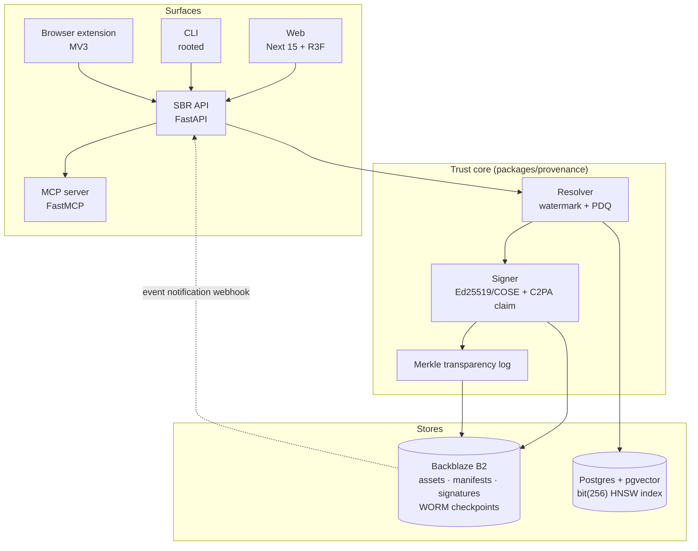

# ROOTED

**Recover stripped C2PA provenance for AI-generated media, on Backblaze B2.**

[](https://github.com/StephenSook/rooted/actions/workflows/ci.yml)
[](./LICENSE)
[](https://rooted-web-phi.vercel.app)
[](./pyproject.toml)
[](./web)
[](https://spec.c2pa.org/specifications/specifications/2.4/softbinding/Decoupled.html)

Rooted is an open-source, vendor-neutral C2PA Soft Binding Resolution (SBR) server. When an image,
audio clip, or video is generated and signed, then later shows up with its embedded C2PA manifest
destroyed (after a screenshot or a re-encode), Rooted recovers the full provenance by matching an
invisible watermark or a perceptual-hash fingerprint against manifests stored in Backblaze B2, and
returns the recovered, signed manifest with a tamper-evident transparency-log proof.

Backblaze B2 is the recovery repository the whole system depends on, not an add-on. Every signed
asset, manifest, and COSE signature is addressed by its content hash on B2, so recovery returns
exactly the bytes that were signed, and the Merkle transparency checkpoints seal to a B2 Object Lock
bucket under compliance retention, immutable by construction. An SBR server is only as good as the
durable, vendor-neutral repository it recovers from, and that repository is B2.

## Live demo

| Surface | Where |
|---|---|
| Web | <https://rooted-web-phi.vercel.app> |
| SBR API | <https://rooted-api-ubvc.onrender.com> |
| MCP server | `https://rooted-api-ubvc.onrender.com/mcp` (judge-connectable over HTTP) |
| CLI | `pip install` the `cli/` package, then `rooted recover stripped.jpg` |
| Browser extension | load `extension/` unpacked (see [extension/README.md](./extension/README.md)) |

Open the site and click **recover the demo asset**: a real AI-generated image (created with Genblaze
on GMI Cloud, model seedream-5.0-lite) is recovered to **VERIFIED**, the recovered manifest names that
model, a separately C2PA-credentialed sample is read in the browser to show its Content Credentials,
and the transparency log renders as a 3D Merkle tree. The deployed instance stores each asset,
manifest, and signature content-addressably on Backblaze B2 (verifiable live at `/demo/storage`) and
runs recovery on Postgres + HNSW. Provenance proves origin, not truth.

## The problem

Fewer than 1% of images published online carry C2PA metadata, and embedded manifests are routinely
stripped by social platforms and re-encodes. C2PA's answer is durable recovery: recover the stripped
manifest from a repository using a watermark or a fingerprint. The reference production
manifest-recovery service today is Adobe's Content Credentials Cloud, and it is a closed,
single-vendor hosted service. Rooted is the open, self-hostable, vendor-neutral version, on commodity
object storage you control, across image, audio, and video, with a WORM transparency log and an MCP
surface for AI agents.

## What it does

1. **Generate and sign.** A provider generates media; Rooted watermarks it (TrustMark variant P),
   computes a PDQ perceptual hash, signs the manifest (Ed25519 / COSE), maps it to a C2PA claim, and
   stores the asset, manifest, and signature on Backblaze B2.
2. **Index and log.** The watermark id and the PDQ `bit(256)` hash go into the recovery index
   (Postgres + pgvector HNSW), and the manifest's canonical hash is appended to a Merkle transparency
   log whose signed checkpoints seal to a B2 Object Lock bucket.
3. **Recover.** The asset circulates and loses its manifest. Given the stripped bytes, the SBR API
   tries the watermark (an exact pointer) first, then falls back to the PDQ fingerprint (nearest
   within Hamming distance 31), returns the recovered signed manifest with a SB 942 redaction split
   (system provenance out, personal provenance withheld), and an inclusion proof pinned to a signed
   checkpoint.

## Rooted in one loop



## Architecture

Five surfaces over one trust core over two stores. Backblaze B2 holds the durable, content-addressed
record and the WORM transparency seal; Postgres holds the fast recovery index.



## What is real (capability honesty)

Everything below is wired end to end and demonstrable. Numbers in any submission come from the test
suite, never from draft prose.

| Area | State |
|---|---|
| SBR recovery loop (watermark, then PDQ fallback), C2PA v2.4 routes, camelCase per the spec | wired, tested, live |
| Backblaze B2 as the recovery repository (content-addressed assets / manifests / signatures) | wired + live |
| Merkle transparency log + signed checkpoints, sealed to a B2 Object Lock (WORM) bucket, read back + verified | wired + live |
| Postgres + pgvector HNSW `bit(256)` recovery index, selected by `DATABASE_URL` | wired + live (`recoveryIndex: postgres+hnsw`) |
| Real Genblaze generation (GMICloud primary, OpenAI fallback) | wired + demonstrated: the live demo recovers a real GMICloud generation |
| Genblaze AssemblyAI speech-to-text: a real speech clip to a hash-verified transcript, reconciled with Rooted's signature, stored on B2 | wired + live |
| Genblaze writes its own run to B2 via its `ObjectStorageSink`, reconciled with Rooted's signature | wired + live |
| Multi-provider recovery (Nano Banana 2 / Flux 2 Pro / Qwen via kie.ai), vendor-neutral | wired + live |
| TrustMark variant P watermark (opt-in via `ROOTED_REAL_WATERMARK`) + PDQ fallback | wired + verified |
| Audio + video modalities (spectral audio fingerprint, per-keyframe video PDQ) | wired + live |
| Green C2PA "Trusted" via the conformance test trust list (labeled FOR TESTING ONLY) | wired + live |
| C2PA ingredient-DAG lineage + a 3D graph; tamper-diff forensics (which signed field changed vs the registry) | wired + live |
| Side-by-side vs the official C2PA reader (No Content Credentials vs RECOVERED on the same bytes) | wired + live |
| FastMCP product server (judge-connectable over HTTP) + a live Claude provenance agent | wired + live |
| Published `rooted` SBR CLI | wired + live |
| Browser extension (right-click any image to recover its provenance) | wired (load unpacked) |
| B2 Event-Notification ingest (B2 upload to a signed webhook to auto-ingest to recoverable) | wired; pending account-level Event Notifications enablement |

## The surfaces

- **Web** (`/web`): a Next.js 15 front end with the FAILED to VERIFIED recovery reveal, the side-by-side
  vs the official C2PA reader, the Content Credentials panel (c2pa-web), and a 3D Merkle explorer.
- **SBR API** (`/api`): the C2PA v2.4 Soft Binding Resolution routes, signing, the SB 942 redaction,
  the transparency routes, and the B2 event-ingest webhook.
- **MCP server** (`/mcp` and mounted at `/mcp` on the API): three curated tools so an AI agent can
  verify provenance, recover manifests, and query the transparency log conversationally.
- **CLI** (`/cli`): the published `rooted` command (`recover`, `status`, `manifest`, `proof`,
  `algorithms`) wrapping the public SBR API.
- **Browser extension** (`/extension`): a Manifest V3 extension that recovers provenance for any image
  on the web from a right-click.
- **B2 event ingest**: a Backblaze B2 Event Notification rule posts a signed webhook when an object
  lands under a watched prefix; Rooted verifies the HMAC, fetches the object, and registers it for
  recovery. Drop an asset in B2 and it auto-becomes recoverable.

## SBR API

Real C2PA v2.4 Soft Binding Resolution routes, contract-tested with schemathesis against
`/openapi.json`:

- `GET /services/supportedAlgorithms` (PDQ is an internal index, never advertised)
- `POST /matches/byContent`, `GET /matches/byBinding` to `{matches: [{manifestId, similarityScore?}]}`
- `GET /manifests/{id}` (redacted: system provenance out, personal provenance withheld)
- `GET /transparency/checkpoint`, `GET /transparency/proof/{id}` (proof pinned to a signed checkpoint)
- `POST /ingest` (trusted generation-side; gated by `ROOTED_INGEST_KEY`, required in production)

## Tech stack

- **Backend**: Python 3.11 to 3.13, FastAPI + Pydantic v2 (async-first), `uv` workspace. In-process
  generation, no task queue. Postgres index via sync psycopg + raw SQL (no ORM, no migrations).
- **Provenance**: c2pa-python, TrustMark (variant P), pdqhash, cryptography (Ed25519), pycose
  (COSE_Sign1), pymerkle.
- **Storage / data**: Backblaze B2 (b2sdk), Postgres 16 + pgvector 0.8 (HNSW `bit_hamming_ops`).
- **Front end**: Next.js 15, React 19, Tailwind v4, three.js + react-three-fiber, react-force-graph,
  @contentauth/c2pa-web, openapi-typescript + openapi-fetch + TanStack Query.
- **MCP**: FastMCP. **CLI**: typer + httpx. **Extension**: Manifest V3 (no build step).

## Repo layout

```
/api          FastAPI SBR API (C2PA v2.4 routes), signing, SB 942 redaction, transparency, B2 event webhook
/worker       the generate -> watermark -> store -> sign -> index -> log ingest pipeline + Genblaze generator
/mcp          Rooted's own MCP server (FastMCP): verify_asset, recover_manifest, query_transparency_log
/cli          the published `rooted` SBR CLI (rooted-sbr)
/extension    Manifest V3 browser extension: right-click any image to recover its provenance
/packages
  /provenance trust core: models + canonical hashing, Ed25519/COSE, c2pa-python claim, PDQ, Merkle log
  /storage    Backblaze B2 (b2sdk), PostgresIndex (pgvector bit(256) HNSW), transparency store
/web          Next.js 15 front end: R3F galaxy, recovery reveal, C2PA display, 3D Merkle explorer
/scripts      one-shot ops (B2 Object Lock activation, B2 event-rule configurator)
```

## Quickstart

```bash
cp .env.example .env                       # fill real values (B2, provider keys, platform tokens)
uv sync --locked --all-packages --dev      # backend deps
uv run fastapi dev api/main.py             # the SBR API on :8000 (ingest runs in-process)
cd web && pnpm install && pnpm dev         # the front end
```

`DATABASE_URL` selects the Postgres index (live recovery on Postgres + HNSW); unset, Rooted runs on an
in-memory index so the demo needs no database. `docker compose up` brings up Postgres (pgvector) for
local Postgres-backed runs.

## Verification

```bash
uv run ruff check . && uv run ruff format --check .   # CI gates on these
uv run mypy .                                         # strict; CI gates on this too
uv run pytest                                         # incl. real-Postgres tests via pgserver
uvx schemathesis run http://localhost:8000/openapi.json --checks all   # SBR contract
cd web && pnpm test                                  # front-end component tests (Vitest + RTL), CI gate
cd web && pnpm test:e2e                               # Playwright E2E vs the live (or E2E_BASE_URL) stack
```

The Playwright E2E drives the real recovery flow end to end (front end to the `/api` proxy to SBR
recovery) against the deployed site by default. A load smoke against the SBR read endpoints held 0
failures at p95 around 6 ms, so the live demo holds up under concurrent judges.

## Deploy

- **Front end**: Vercel (`rooted-web`), typed from the backend `/openapi.json`, `/api/*` proxied to the
  API.
- **API + Postgres**: Render (`rooted-api`, always-on) + a managed Postgres.
- **B2 buckets**: a dev bucket for iteration and a separate Object Lock (compliance retention) bucket
  for the WORM transparency seal.

A scheduled keepalive ping keeps the live app and database warm through the judging window.

## Honesty and limitations

- Provenance proves origin, not truth. A self-signed credential shows "Valid," not the green
  "Trusted" state, which needs a Conformance-Program CA. Rooted shows the green "Trusted" state by
  validating against the C2PA conformance test trust list, labeled FOR TESTING ONLY on screen; a
  production deployment validates against the C2PA production trust list.
- Rooted builds on Adobe's open-source TrustMark variant P watermark; the recovery concept and the
  canonical SBR API are also Adobe's prior art. Rooted's contribution is the open, self-hostable
  server, the Backblaze B2 recovery repository, the WORM transparency log, and the MCP surface, not
  the watermark or the SBR idea.
- PDQ is an internal recovery index, not a C2PA-registered fingerprint algorithm, so it is never
  advertised on `/services/supportedAlgorithms`.
- A single Rooted instance only recovers manifests it has ingested. The SBR spec's larger goal is
  federated, cross-repository lookup; a single instance does not deliver that network effect.
- The B2 Event-Notification ingest is wired and tested, and goes live once Backblaze enables
  account-level Event Notifications (a request-gated feature).

## License

Apache-2.0. See [LICENSE](./LICENSE).
