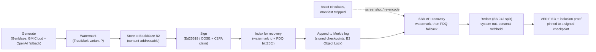

# Rooted

An open-source, vendor-neutral C2PA Soft Binding Resolution (SBR) server backed by Backblaze B2.
Rooted recovers stripped C2PA provenance manifests for AI-generated media. When an image is generated
and signed, then later shows up with its embedded manifest destroyed (after a screenshot or a
re-encode), Rooted recovers the full provenance by matching an invisible watermark or a
perceptual-hash fingerprint against manifests stored in B2, and returns the recovered, signed
manifest with a tamper-evident transparency-log proof.

## Why it exists

Fewer than 1% of images published online carry C2PA metadata, and embedded manifests are routinely
stripped by social platforms and re-encodes. C2PA's answer is durable recovery: recover the stripped
manifest from a repository using a watermark or fingerprint. The only production manifest-recovery
service today is Adobe's, and it is Adobe-only. Rooted is the open, vendor-neutral version, on
commodity object storage you control.

## The loop



Recovery tries the watermark (an exact pointer) first, then falls back to the PDQ perceptual-hash
(nearest within Hamming distance 31), with a cross-layer integrity check that rejects a watermark id
pointing at an unrelated asset. Rooted also exposes its own MCP server so an AI agent can verify
provenance, recover manifests, and audit the transparency log conversationally.

## Repo layout

```
/api          FastAPI SBR API (C2PA v2.4 routes), signing, SB 942 redaction, transparency routes
/worker       the generate -> watermark -> store -> sign -> index -> log ingest pipeline
/mcp          Rooted's own MCP server (FastMCP): verify_asset, recover_manifest, query_transparency_log
/packages
  /provenance trust core: models + canonical hashing, Ed25519/COSE, c2pa-python claim, PDQ, Merkle log
  /storage    Backblaze B2 (b2sdk), PostgresIndex (pgvector-free bit(256) Hamming), transparency store
/web          Next.js 15 front end (in progress)
```

## Status (what is wired today, honestly)

| Area | State |
|---|---|
| Trust core, recovery, SBR API (camelCase per the C2PA SBR spec) | wired, tested, CI green |
| Transparency log (signed checkpoint + independently-verifiable, restart-durable proofs) | wired, tested |
| FastMCP product server (three curated tools) | wired, tested |
| PostgresIndex (pooled + self-healing, atomic ingest) selected by `DATABASE_URL` | wired, real-Postgres tested via pgserver |
| Real Genblaze generation (GMICloud primary, OpenAI fallback) | wired; provider-verified to the API boundary; a real image needs a funded provider account |
| TrustMark variant P watermark | behind the optional `watermark` extra; recovery also works via the PDQ fallback |
| Front end, audio/video modalities, Render/Vercel deploy | in progress / not yet wired |

Numbers in any submission are taken from the actual test suite, never copied from draft prose.

## SBR API

Real C2PA v2.4 Soft Binding Resolution routes, contract-tested with schemathesis against
`/openapi.json`:

- `GET /services/supportedAlgorithms` (PDQ is an internal index, never advertised)
- `POST /matches/byContent`, `GET /matches/byBinding` -> `{matches: [{manifestId, similarityScore?}]}`
- `GET /manifests/{id}` (redacted: system provenance out, personal provenance withheld)
- `GET /transparency/checkpoint`, `GET /transparency/proof/{id}` (proof pinned to a signed checkpoint)
- `POST /ingest` (trusted generation-side convenience)

## Quickstart

```bash
cp .env.example .env                       # fill real values (B2, provider keys, platform tokens)
uv sync --locked --all-packages --dev      # backend deps
uv run fastapi dev api/main.py             # the SBR API on :8000
uv run dramatiq worker.main                # the ingest pipeline worker
cd web && pnpm install && pnpm dev         # the front end (in progress)
```

`DATABASE_URL` selects the Postgres index (live recovery on Postgres); unset, Rooted runs on an
in-memory index so the demo needs no database. `docker compose up` brings up Postgres (pgvector) and
Redis for local Postgres-backed runs.

## Testing

```bash
uv run ruff check . && uv run ruff format --check .   # CI gates on these
uv run pytest                                         # incl. real-Postgres tests via pgserver
uv run mypy .                                         # local (not a CI gate yet)
uvx schemathesis run http://localhost:8000/openapi.json --checks all   # SBR contract
uvx locust -f load/locustfile.py --host http://localhost:8000 --headless -u 20 -r 5 -t 15s  # load
```

The load smoke hits the SBR read endpoints; a recent run held 0 failures at p95 ~6 ms (~60 req/s),
so the live demo will not fall over under concurrent judges.

## Honesty and limitations

- Provenance proves origin, not truth. A self-signed credential shows "Valid," not the green
  "Trusted" state, which needs a Conformance-Program CA; Rooted demos the green path via the C2PA
  conformance test mode, labeled on screen as test mode, rather than hiding the distinction.
- Hamming search is exact via native Postgres `bit_count`; pgvector HNSW `bit_hamming_ops` is an
  optional accelerator for very large indexes, not claimed as wired.
- Known follow-ups on the deployed Postgres path: a single ingest transaction spanning the index and
  transparency stores, a lock around lazy resolver init, and closing pools on shutdown.

## License

Apache-2.0. See [LICENSE](./LICENSE).
